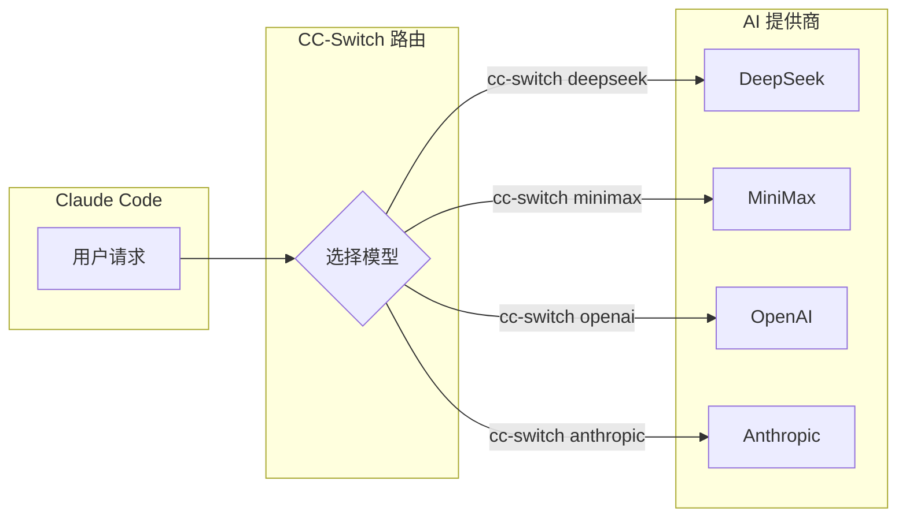

# CC-Switch

一个 Claude Code 工具，可以快速切换不同的 AI 模型服务。

## 特点

- **多模型切换**：支持切换到不同的 AI 提供商
- **配置简单**：通过配置文件管理多个 API
- **统一接口**：用同一套命令调用不同模型

## 核心概念



## 安装

```bash
# 克隆仓库
git clone https://github.com/idootop/cc-switch.git
cd cc-switch

# 运行
python cc_switch.py
```

## 配置

编辑配置文件，添加不同的 API：

```json
{
  "providers": {
    "deepseek": {
      "api_key": "your-deepseek-key",
      "base_url": "https://api.deepseek.com"
    },
    "minimax": {
      "api_key": "your-minimax-key",
      "base_url": "https://api.minimax.chat/v1"
    }
  }
}
```

## 使用

```bash
# 切换到 DeepSeek
cc-switch deepseek

# 切换到 MiniMax
cc-switch minimax

# 查看当前配置
cc-switch status
```

## 适用场景

- 需要使用多个 AI 提供商
- 想比较不同模型的效果
- 某个 API 不可用时快速切换

## 相关工具

- [[工具-ClaudeCode|Claude Code]] - AI 编程助手
- [[工具-DeepSeek|DeepSeek]] - AI 模型
- [[工具-MiniMax|MiniMax]] - AI 模型
- [[工具-OpenCode|OpenCode]] - AI 编程助手
