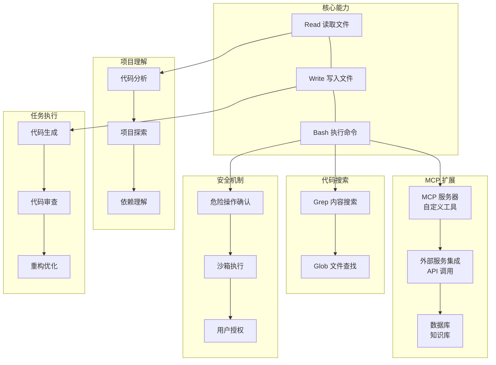

# ClaudeCode

ClaudeCode是Anthropic推出的AI编程助手。

## 特点

- 深度理解代码库
- 安全优先（不会执行危险操作）
- 可以帮你写代码、调试、重构
- 支持代码审阅

## 核心概念

## 使用场景

- 编程、代码分析、项目探索
- 代码重构和优化
- Bug定位和修复

## 核心能力

- 读写文件
- 执行命令
- 搜索代码库
- 代码审查
- 项目理解

## 相关工具

- [[工具-Zed|Zed]] - 支持 ACP 的代码编辑器
- [[工具-CC-Switch|CC-Switch]] - 模型切换工具
