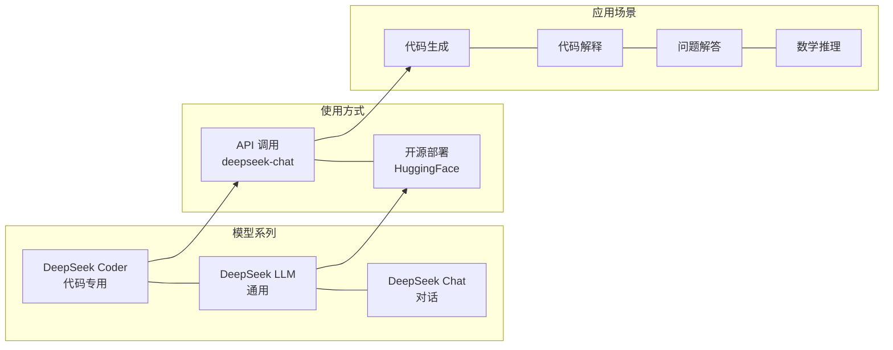

# DeepSeek

DeepSeek是中国深度探索科技公司开发的大语言模型。

## 特点

- **开源模型**：DeepSeek Coder、DeepSeek LLM 等开源可商用
- **代码能力强**：代码生成、解释能力出色
- **性价比高**：API 价格相对较低
- **中文优化**：中文理解能力强

## 核心概念



## 模型系列

| 模型 | 说明 |
|------|------|
| DeepSeek Coder | 专注于代码生成 |
| DeepSeek LLM | 通用大语言模型 |
| DeepSeek Chat | 对话模型 |

## 使用场景

- AI编程辅助
- 代码生成和解释
- 问题解答
- 数学推理

## API调用

```python
from openai import OpenAI

client = OpenAI(
    api_key="your-api-key",
    base_url="https://api.deepseek.com"
)

response = client.chat.completions.create(
    model="deepseek-chat",
    messages=[{"role": "user", "content": "你好"}]
)
```

## 相关工具

- [[工具-CC-Switch]] 支持大模型路由
