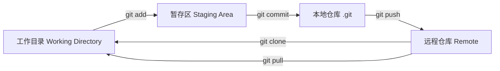
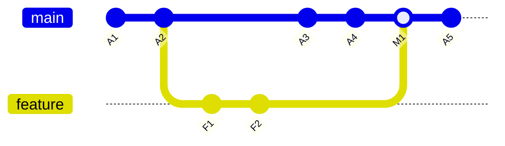

# Git

> Git是最常用的分布式版本控制系统

## 特点

- **分布式**：每个开发者都有完整的代码仓库副本
- **分支管理**：轻量级分支，支持快速创建和切换
- **完整性**：保证代码内容不被损坏
- **免费开源**：完全免费，社区活跃

## 核心概念

### 提交与分支关系

| 概念             | 说明            |
| -------------- | ------------- |
| **Repository** | 仓库，存放代码和历史的地方 |
| **Commit**     | 提交，代码的快照      |
| **Merge**      | 将两个分支的修改合并到一起 |
| **Branch**     | 分支，独立的开发线     |
| **Remote**     | 远程仓库，如 GitHub |
| **HEAD**       | 当前所在的提交位置     |

## 使用场景

- 代码版本管理
- 多人协作开发
- [[概念-代码回滚|代码回滚]]
- 历史查看
- 分支并行开发

## AI编程的风险

使用AI编程时，Git尤为重要：

- **改坏代码**：AI可能修改现有代码导致功能损坏
- **删除代码**：AI可能误删重要代码
- **重写代码**：AI可能重写原本正常工作的代码

**解决方案**：频繁提交，每次AI操作后检查diff

## 相关工具

- [[工具-github|GitHub]] - 代码托管平台
- [[工具-lazygit|lazygit]] - Git TUI 工具
