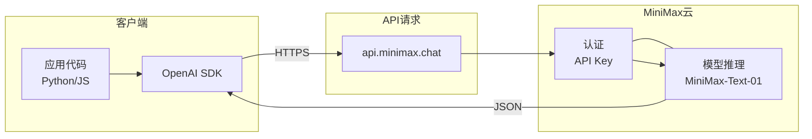

# MiniMax

MiniMax是中国的一家AI科技公司，提供大语言模型API服务。

## 特点

- 中文理解能力强
- 代码生成能力出色
- 价格相对实惠
- 响应速度快

## 核心概念



## 使用场景

- AI编程辅助
- 代码生成和解释
- 问题解答

## API调用

```python
from openai import OpenAI

client = OpenAI(
    api_key="your-api-key",
    base_url="https://api.minimax.chat/v1"
)

response = client.chat.completions.create(
    model="MiniMax-Text-01",
    messages=[{"role": "user", "content": "你好"}]
)
```

## 相关工具

- [[工具-CC-Switch]] 支持大模型路由
