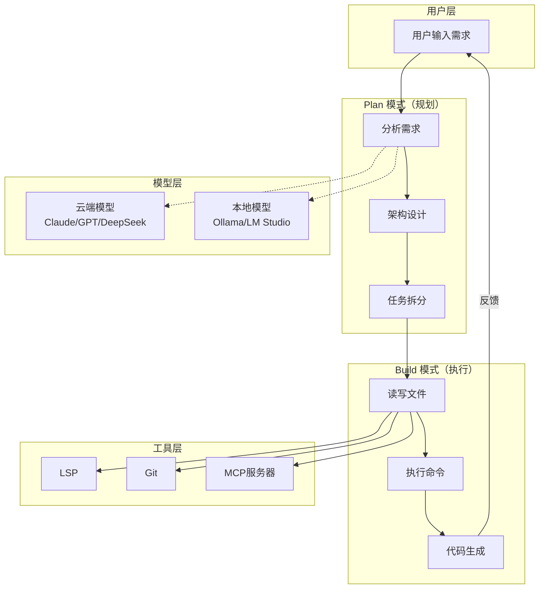

# OpenCode

基于终端的 AI 编程助手，由 Go 语言编写。

## 特点

- **多模型支持**：支持 75+ LLM（Claude、GPT、DeepSeek、GLM 等）
- **双模式**：Plan（架构设计）+ Build（代码实现）
- **终端界面**：基于 Bubble Tea 的交互式 TUI
- **多会话管理**：支持多个会话切换
- **MCP 支持**：可配合模型上下文协议服务器使用
# 核心概念



# 安装

```bash
# macOS / Linux
brew install sst/tap/opencode

# npm
npm i -g opencode-ai@latest

# 脚本安装
curl -fsSL https://opencode.ai/install | bash

# 验证
opencode --version
```

# 使用

## 启动

```bash
opencode
```

## 常用命令

| 操作     | 命令                               |
| ------ | -------------------------------- |
| 启动交互模式 | `opencode`                       |
| 查看版本   | `opencode --version`             |
| 模型配置   | `opencode config set model <模型>` |
| 新建会话   | `opencode new`                   |
| 列出会话   | `opencode sessions`              |

## 相关工具

- [[工具-Zed|Zed]] - 支持 ACP 的代码编辑器
- [[工具-CC-Switch|CC-Switch]] - 模型切换工具
