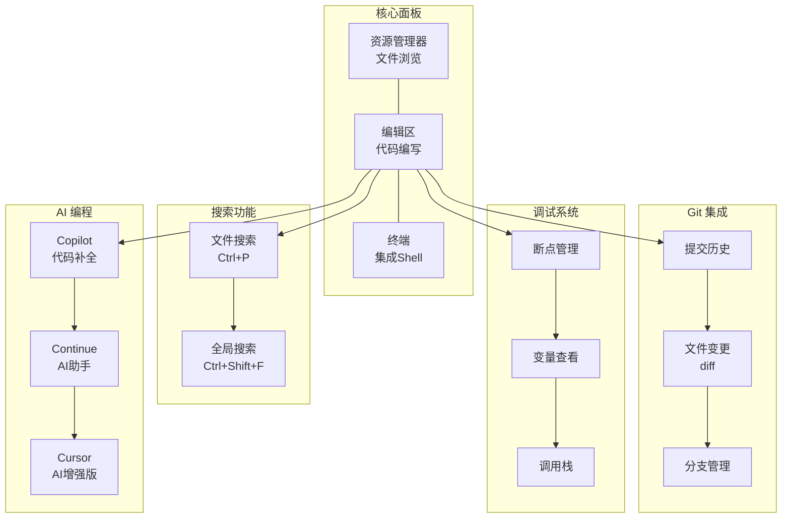

# VS Code

Visual Studio Code，由微软开发的免费代码编辑器。

## 特点

- **免费开源**：完全免费，MIT 许可证
- **插件生态丰富**：数千款插件满足各种需求
- **跨平台**：Windows、macOS、Linux 都能用
- **内置终端**：集成终端支持
- **智能提示**：IntelliSense 代码补全
- **调试支持**：内置调试器

## 核心概念



## 安装

```bash
# Windows
winget install Microsoft.VisualStudioCode

# macOS
brew install --cask visual-studio-code

# Linux
sudo apt install code  # Debian/Ubuntu
```

## 核心功能

| 功能 | 说明 |
|------|------|
| 资源管理器 | 文件浏览和管理 |
| 搜索 | 全局搜索和替换 |
| Git | 集成 Git 版本控制 |
| 调试 | 内置调试器 |
| 终端 | 集成终端 |
| 扩展 | 插件管理 |

## 常用快捷键

| 操作 | Windows/Linux | macOS |
|------|---------------|-------|
| 命令面板 | `Ctrl+Shift+P` | `Cmd+Shift+P` |
| 文件搜索 | `Ctrl+P` | `Cmd+P` |
| 全局搜索 | `Ctrl+Shift+F` | `Cmd+Shift+F` |
| 打开终端 | `` Ctrl+` `` | `` Cmd+` `` |
| 切换标签 | `Ctrl+Tab` | `Cmd+Tab` |
| 保存文件 | `Ctrl+S` | `Cmd+S` |
| 复制行 | `Ctrl+C` | `Cmd+C` |
| 粘贴行 | `Ctrl+V` | `Cmd+V` |
| 注释 | `Ctrl+/` | `Cmd+/` |

## 推荐插件

| 插件 | 说明 |
|------|------|
| GitLens | Git 可视化增强 |
| Prettier | 代码格式化 |
| ESLint | JavaScript 代码检查 |
| Python | Python 开发支持 |
| Live Server | 本地开发服务器 |
| Copilot | AI 代码辅助 |

## AI 编程

VS Code 支持多种 AI 编程插件：

- **GitHub Copilot**：AI 代码补全
- **Continue**：开源 AI 编程助手
- **Cursor**：AI 增强的 VS Code fork

## 适用场景

- Web 开发（前端/后端）
- Python、Java、C++ 等多语言开发
- 文档编写（Markdown）
- 任何需要代码编辑的场景

## 相关工具

- [[工具-Git|Git]] - 版本控制
- [[工具-GitHub|GitHub]] - 代码托管平台
- [[工具-lazygit|lazygit]] - Git TUI
