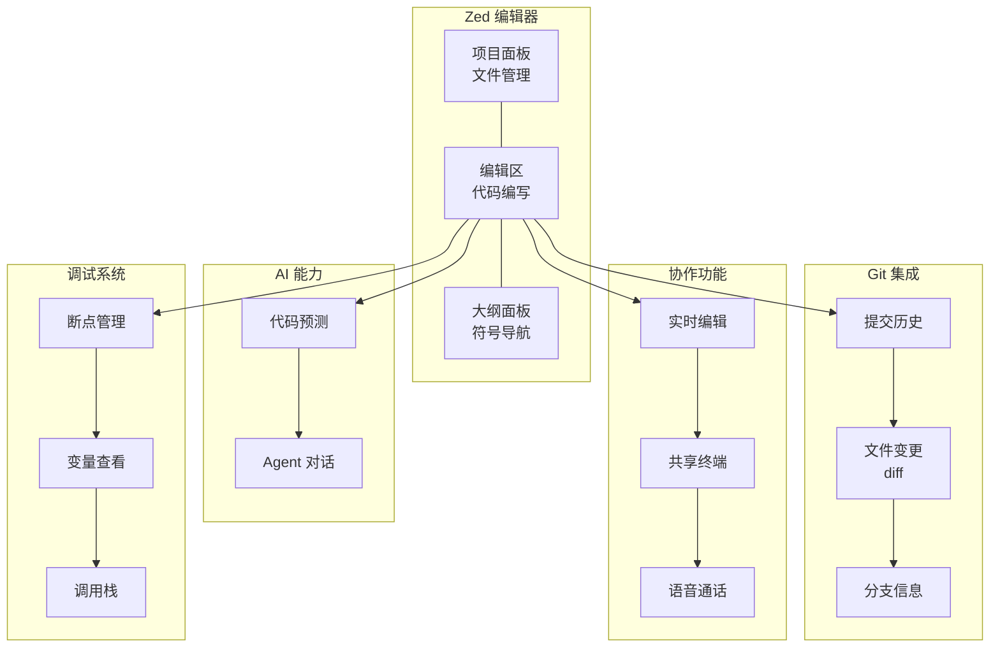

# Zed

高性能代码编辑器，由 Rust 编写。

## 特点

- **轻量**：Rust 构建，启动比 VS Code 快 4 倍
- **内置 AI**：支持代码预测，支持简单Agent
- **多人协作**：实时共享编辑
- **开源**：约 27 万行 Rust 代码

# 核心概念



# 安装

```bash
# macOS / Linux
curl https://zed.dev/install.sh | sh

# Windows
winget install Zed

# 验证
zed --version
```

# 使用

## 项目面板

显示项目文件结构，支持文件操作。

| 操作   | 快捷键        |
| ---- | ---------- |
| 新建文件 | `Ctrl + N` |
| 重命名  | `F2`       |

## Git 面板

查看 Git 提交历史和变更。

| 操作 | 快捷键 |
|------|--------|
| 打开 Git 面板 | `Ctrl + Shift + G` |
| 查看提交历史 | 面板中滚动 |
| 查看文件 diff | 点击文件 |

### 功能

- 提交历史浏览
- 当前文件变更提示
- 分支信息显示

## 大纲面板

显示代码结构，支持符号导航。

| 操作   | 快捷键                |
| ---- | ------------------ |
| 打开大纲 | `Ctrl + Shift + B` |
| 跳转符号 | 点击或搜索              |

### 功能

- 类/函数列表
- 变量定义
- 快速跳转

## 协作面板

实时多人协作编辑。

| 操作   | 快捷键                   |
| ---- | --------------------- |
| 打开面板 | `Ctrl + Shift + C` 按钮 |
| 加入协作 |                       |

### 功能

- 实时共享编辑
- 共享终端
- 语音通话

## 搜索面板

快速搜索文件和内容。

| 操作 | 快捷键 |
|------|--------|
| 文件搜索 | `Ctrl + P` |
| 内容搜索 | `Ctrl + Shift + F` |
| 搜索下一个 | `Enter` |
| 搜索上一个 | `Shift + Enter` |

### 功能

- 文件名搜索
- 全局内容搜索
- 正则表达式支持

## 诊断面板

显示代码问题和建议。

| 操作    | 快捷键                |
| ----- | ------------------ |
| 打开诊断  | `Ctrl + Shift + M` |
| 跳转到问题 | 点击诊断项              |

### 功能

- 语法错误提示
- 类型错误
- 代码风格警告

## 终端面板

集成终端。

| 操作   | 快捷键          |
| ---- | ------------ |
| 打开终端 | ` Ctrl + ` ` |

### 功能

- 多终端支持
- 分屏显示
- 环境变量继承

## Debug 面板

调试代码。

| 操作 | 快捷键 |
|------|--------|
| 打开调试 | `F5` 或侧边栏 |
| 设置断点 | 点击行号 |
| 继续执行 | `F5` |
| 单步跳过 | `F10` |
| 单步进入 | `F11` |
| 单步退出 | `Shift + F11` |

### 功能

- 断点管理
- 变量查看
- 调用栈
- 监视表达式

## Agent 面板

AI 辅助编程。

| 操作       | 快捷键                |
| -------- | ------------------ |
| 打开 Agent | `Ctrl + Shift + /` |
| 发送消息     | `Enter`            |
| 换行       | `Shift + Enter`    |
| 新对话      | `Ctrl + N`         |

### 功能

- 自然语言对话
- 代码生成
- 代码解释
- 重构建议

## 快捷键

| 操作 | 快捷键 |
|------|--------|
| 命令面板 | `Cmd/Ctrl + Shift + P` |
| AI 助手 | `Cmd/Ctrl + K` |
| 终端 | `` Cmd/Ctrl + ` `` |
| 文件搜索 | `Cmd/Ctrl + P` |

## 常用命令

| 操作      | 命令         |
| ------- | ---------- |
| 打开文件    | `zed <文件>` |
| 在文件夹内打开 | `zed .`    |

## 插件系统

安装插件
1. Ctrl + Shift + X
2. 搜索并安装插件

## 相关工具

- [[工具-VScode|VS Code]] - 另一个流行的代码编辑器
- [[工具-OpenCode|OpenCode]] - AI 编程助手
- [[工具-Git|Git]] - 版本控制

