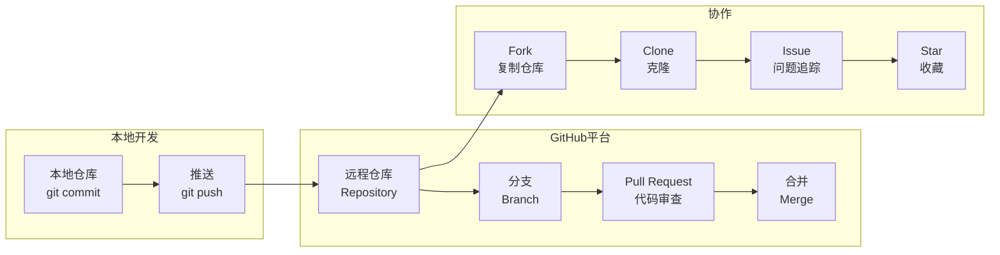

# GitHub

全球最大的代码托管平台。

## 特点

- **代码托管**：免费托管开源和私有仓库
- **协作功能**：Pull Request、Issue、Wiki
- **CI/CD**：GitHub Actions 自动化
- **社交**：关注开发者，Star 项目

## 核心概念



| 概念 | 说明 |
|------|------|
| **Repository** | 代码仓库 |
| **Branch** | 分支 |
| **Commit** | 提交记录 |
| **Pull Request** | 请求合并代码 |
| **Issue** | 问题追踪 |
| **Star** | 收藏项目 |
| **Fork** | 复制仓库 |

## 常用操作

### 创建仓库

1. 点击右上角 **+** → **New repository**
2. 填写仓库名
3. 选择 Public/Private
4. 点击 Create

### 克隆仓库

```bash
git clone https://github.com/用户名/仓库名.git
```

### 推送代码

```bash
git add .
git commit -m "提交信息"
git push origin main
```

### Pull Request

1. Fork 目标仓库
2. 创建分支并修改
3. 发起 Pull Request
4. 等待审核合并

## 相关工具

- [[工具-Git|Git]] - 版本控制
- [[示例-Git基本命令|Git基本命令]] - Git 命令
- [[示例-GitHub协作|GitHub协作]] - GitHub 协作流程
- [[工具-lazygit|lazygit]] - Git TUI
