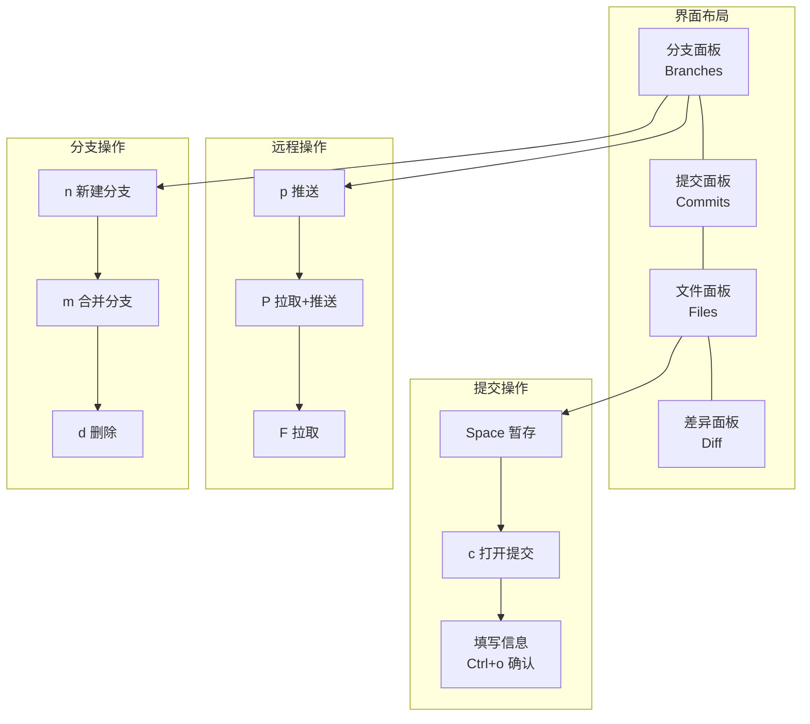

# lazygit

一个简单的 Git TUI（终端用户界面），用 Go 语言编写。

## 特点

- **简单高效**：告别复杂的 git 命令
- **可视化**：直观显示分支、提交、冲突
- **键盘操作**：完全用键盘操作
- **轻量快速**：启动迅速，资源占用低

## 核心概念



## 安装

```bash
# macOS
brew install lazygit

# Linux
sudo pacman -S lazygit  # Arch
sudo apt install lazygit  # Debian/Ubuntu

# Windows
winget install JesseDuffield.lazygit

# 验证
lazygit --version
```

## 界面

```
┌─ Branches ──────────────────────────────────────────────┐
│ > develop                                               │
│   main                                                  │
├─ Commits ───────────────────────────────────────────────┤
│ ┌─ Files ────────────────────────────────────────────┐  │
│ │ M 组合/02-第一个让AI编写的程序？.md                │  │
│ │ A  原子/工具-DeepSeek.md                           │  │
│ └────────────────────────────────────────────────────┘  │
└─────────────────────────────────────────────────────────┘
```

## 常用操作

| 操作 | 按键 |
|------|------|
| 切换面板 | `Tab` / `Shift+Tab` |
| 选择 | `方向键` |
| 确认/Space | `Space` |
| 返回/退出 | `q` 或 `Esc` |
| 提交 | `c` |
| 推送 | `p` |
| 拉取 | `F` |
| 新建分支 | `n` |
| 合并分支 | `m` |
| 暂存文件 | `Space` |
| 查看差异 | `d` |
| 拉取/推送 | `P` |

## 分支操作

1. `n` 新建分支
2. `d` 删除分支
3. `m` 合并分支

## 提交操作

1. 方向键选中文件
2. `Space` 暂存/取消暂存
3. `c` 打开提交面板
4. 填写提交信息
5. `Ctrl+o` 确认提交

## 推送操作

1. 切换到分支面板
2. 选中分支
3. `p` 推送到远程

## 适用场景

- 日常 Git 操作
- 查看提交历史
- 处理合并冲突
- 管理多个分支

## 相关工具

- [[工具-Git|Git]] - Git 命令行工具
