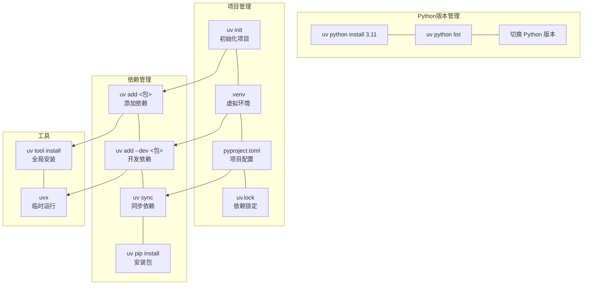

# uv

一个 Python 开发环境管理工具，由 Rust 编写，速度比 pip 快 10-100 倍。

## 特点

- **极速**：安装和解析依赖比 pip 快 10-100 倍
- **一体化**：替代 pip pip-tools pipx poetry pyenv virtualenv
- **Python 版本管理**：无需 pyenv 即可管理多个 Python 版本
- **依赖锁定**：类似 pip-tools，保证环境一致性

# 核心概念



# 安装

```bash
# macOS / Linux
curl -LsSf https://astral.sh/uv/install.sh | sh

# Windows
winget install uv

# 验证
uv --version
```

# 使用

## 虚拟环境

```bash
uv venv                    # 创建虚拟环境
uv venv --python 3.11      # 指定 Python 版本
source .venv/bin/activate  # 激活（Linux/macOS）
.venv\Scripts\activate     # 激活（Windows）
```

> 代码编辑器一般会自动激活环境
## 包管理

```bash
uv pip install requests          # 安装包
uv pip install -r requirements.txt  # 从文件安装
uv add flask                     # 添加项目依赖（更新 pyproject.toml）
uv add --dev pytest              # 添加开发依赖
```

## 项目管理

```bash
uv init              # 初始化新项目
uv sync              # 同步依赖
uv sync --upgrade    # 更新依赖
uv run python main.py   # 运行（无需激活环境）
```

## Python 版本

```bash
uv python install 3.11   # 安装 Python
uv python list           # 列出已安装版本
```

## 工具

```bash
uv tool install ruff    # 全局安装工具
uvx ruff check .        # 临时运行工具
```

## 常用命令速查

| 操作 | 命令 |
|------|------|
| 创建环境 | `uv venv` |
| 安装包 | `uv pip install <包>` |
| 添加依赖 | `uv add <包>` |
| 同步依赖 | `uv sync` |
| 运行脚本 | `uv run <脚本>` |
| 安装 Python | `uv python install <版本>` |
| 临时运行工具 | `uvx <工具> <参数>` |
| 更新 uv | `uv self update` |

## 相关工具

- [[工具-VScode|VS Code]] - 代码编辑器
- [[工具-Git|Git]] - 版本控制
