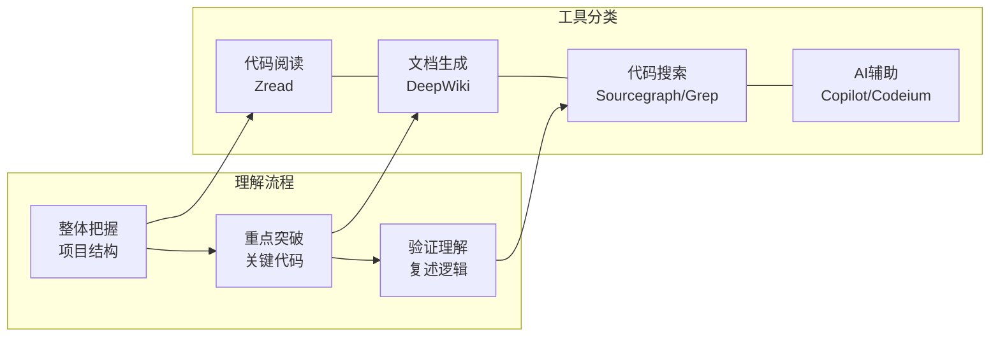

# 代码理解工具

除了让AI解释代码，还有一些专门的工具可以帮助理解代码库。

## 核心概念

## 1. Zread

代码阅读和理解工具，特别适合：
- 快速理解项目结构
- 分析代码逻辑
- 可视化代码关系

## 2. DeepWiki

项目文档生成工具：
- API文档
- 代码结构说明
- 数据流图

## 3. 其他工具

| 工具 | 特点 | 适用场景 |
|------|------|----------|
| Sourcegraph | 代码搜索和分析平台 | 大型代码库搜索 |
| Codeium | AI代码补全和理解 | 日常编程辅助 |
| GitHub Copilot | 代码补全 | IDE内快速理解 |
| Grep.app | 代码搜索 | 搜索特定模式 |

## 使用方法

### 步骤1：整体把握
先用工具了解代码的整体结构

### 步骤2：重点突破
针对关键代码深入理解

### 步骤3：验证理解
用自己的话复述代码逻辑

## 相关工具

- [[工具-ClaudeCode|Claude Code]] - AI 代码解释
- [[工具-Zed|Zed]] - 内置 AI 辅助
- [[工具-OpenCode|OpenCode]] - AI 编程助手
