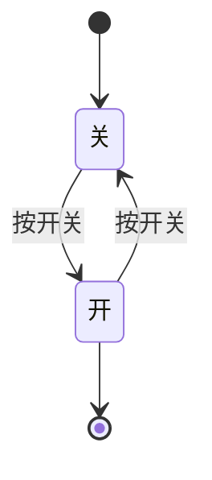
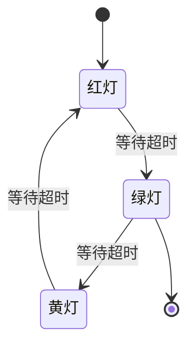
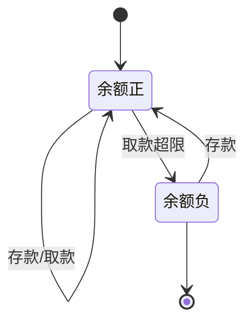

# 状态机

状态机（State Machine）是一种描述系统行为的方法，记录系统"当前处于什么状态"，当发生某些事情时，状态会发生变化。

> 简单理解：状态机 = 状态 + 事件 → 新状态

## 什么是状态机

状态机记录系统的"当前状态"，当外部发生"事件"时，系统根据预设的规则从当前状态转换到新状态，并可能执行某些操作。

## 状态机的组成

- **状态（State）**：系统当前的情况
- **事件（Event）**：触发状态改变的条件
- **转换（Transition）**：从一个状态到另一个状态的规则
- **动作（Action）**：状态转换时执行的操作

## 程序与状态机

程序本质上就是一个状态机：

- 程序运行时的**值**就是状态（如 `isLoggedIn = true`，`count = 5`）
- **用户输入**或**系统事件**是触发条件
- **算法逻辑**（if/else、循环）决定状态如何转换

```python
# 一个简单的状态机示例
status = "未登录"  # 当前状态

def login():
    global status
    status = "登录中"  # 转换到新状态
    # ... 验证逻辑
    status = "已登录"  # 登录成功

def logout():
    global status
    status = "已登录"
    status = "未登录"  # 转换回初始状态
```

## 简单示例

### 示例1：开关灯



- **状态**：关、开`
- **事件**：按开关
- **转换**：开 <=> 关

### 示例2：交通灯



### 示例3：账户余额



> 图中 `[*]` 表示初始状态或结束状态，箭头上的文字表示触发事件。

## 常见应用

- UI 界面状态（加载中、成功、错误）
- 游戏角色状态（站立、奔跑、跳跃）
- 网络请求状态（待发送、发送中、成功、失败）
- 业务逻辑（订单状态、工作流）

## 与 AI 编程的关系

理解状态机有助于：

- 设计清晰的数据结构
- 预测程序的行为
- 避免复杂的状态管理问题
- 与 AI 沟通时更准确地描述系统行为


